# 🎨 Diseño de Sitios Web

> **Repositorio de aprendizaje y prácticas**
> 🎓 **Materia:** Diseño de Sitios Web
> 🚀 **Estado:** En progreso (56% completado)

Bienvenido a mi repositorio académico. Aquí documento mi proceso de aprendizaje, desde los fundamentos de la web hasta el despliegue de sitios responsivos y optimizados.

---

## 🛠️ Stack Tecnológico

### 🎨 Frontend
<div align="center">

| Tecnología | Nivel | Uso en Proyecto |
|-----------|--------|-----------------|
| 📄 HTML5 | ⭐⭐⭐⭐ | Estructura semántica |
| 🎨 CSS3 | ⭐⭐⭐⭐ | Estilos y diseño |
| ⚡ JavaScript | ⭐⭐ | Interactividad básica |
| 📱 Responsive | ⭐⭐⭐ | Adaptación móvil |
| 🎭 Bootstrap | ⭐⭐ | Framework CSS |

</div>

### 🔧 Herramientas de Desarrollo
- **Control de Versiones:** Git & GitHub
- **Editor:** VS Code / Windsurf IDE
- **Diseño:** Responsive Design (Flexbox, Grid)
- **Optimización:** Minificación y compresión

---

## 📁 Estructura del Proyecto

```mermaid
graph TD
    A[📁 diseno-sitios-web/] --> B[📁 semana-01/]
    A --> C[📁 semana-02/]
    A --> D[📁 semana-03/]
    A --> E[📁 semana-04/]
    A --> F[📁 semana-05/]
    A --> G[📁 semana-06/]
    A --> H[📁 semana-07/]
    A --> I[📁 semana-10/]
    A --> J[📁 semana-11/]
    A --> K[📁 semana-12/]
    A --> L[📁 semana-13/]
    A --> M[📁 semana-14/]
    A --> N[📄 README.md]
    
    style A fill:#e1f5fe
    style B fill:#e8f5e8
    style C fill:#e8f5e8
    style D fill:#e8f5e8
    style E fill:#e8f5e8
    style F fill:#e8f5e8
    style G fill:#e8f5e8
    style H fill:#e8f5e8
    style I fill:#e8f5e8
    style J fill:#e8f5e8
    style K fill:#e8f5e8
    style L fill:#e8f5e8
    style M fill:#e8f5e8
    style N fill:#f1f8e9
```



---

## 📊 Estadísticas del Repositorio

<div align="center">

| Métrica | Valor | Detalles |
|---------|--------|---------|
| 📁 **Semanas completadas** | 9/16 | 56% del temario |
| 📏 **Líneas de código** | ~5,000+ | HTML, CSS, JS |
| 🎨 **Tecnologías cubiertas** | 8 | Principales del curso |
| 📱 **Proyectos responsivos** | 6+ | Mobile First |
| 🚀 **Proyectos destacados** | 3 | E-commerce, Perfiles, Catálogos |

</div>

---

## 🌟 Proyectos Destacados

### 🏆 Top 3 Proyectos

#### 1️⃣ **🛍️ PC Gamer Store** (semana-07)
- **Tipo:** E-commerce completo
- **Tecnologías:** HTML5, CSS3, JavaScript
- **Características:** Carrito de compras, catálogo responsivo
- **Estado:** ✅ Completado

#### 2️⃣ **📱 Perfil Redes** (perfil-redes)
- **Tipo:** Red social profesional
- **Tecnologías:** HTML5, CSS3, Font Awesome
- **Características:** Galería de proyectos, estadísticas
- **Estado:** ✅ Completado

#### 3️⃣ **📋 Lista Productos** (semana-14)
- **Tipo:** Catálogo responsivo
- **Tecnologías:** HTML5, CSS3, Bootstrap
- **Características:** Grid adaptativo, filtros
- **Estado:** ✅ Completado

### 🎨 Características Técnicas Comunes
- ✅ **Diseño Mobile First**
- ✅ **CSS Grid y Flexbox**
- ✅ **Componentes reutilizables**
- ✅ **Accesibilidad WCAG**
- ✅ **SEO básico optimizado**

---

## 📅 Tabla de Contenidos y Progreso

### 🔹 Unidad 1: Fundamentos del Desarrollo Web
*Historia, Cliente-Servidor, Protocolos y Normas W3C.*

| Tema | Estado | Carpeta / Práctica |
| :--- | :---: | :--- |
| **1.1** Introducción a la web (HTTP/HTTPS) | ✅ | [Semana 01](./semana-01/) |
| **1.2** Normas W3C y Accesibilidad (WCAG) | ✅ | [Semana 02](./semana-02/) |
| **1.3** Estructura de sitio y mapas de navegación | ✅ | [Semana 03](./semana-03/) |
| **1.4** Intro al desarrollo estático y Herramientas | ✅ | [Semana 04](./semana-04/) |

### 🔹 Unidad 2: Lenguaje de Marcado HTML5
*Estructura semántica, formularios y multimedia.*

| Tema | Estado | Carpeta / Práctica |
| :--- | :---: | :--- |
| **2.1** Estructura básica y etiquetas esenciales | ✅ | [Semana 05](./semana-05/) |
| **2.2** Contenido: Listas, Tablas y Enlaces | ✅ | [Semana 06](./semana-06/) |
| **2.3** Formularios y Validación | ✅ | [Semana 07](./semana-07/) |
| **2.4** Multimedia (Audio, Video, SVG, Canvas) | ⏳ | _Pendiente_ |

### 🔹 Unidad 3: Estilo y Diseño con CSS
*Box Model, Flexbox, Grid y Frameworks.*

| Tema | Estado | Carpeta / Práctica |
| :--- | :---: | :--- |
| **3.1** Fundamentos CSS (Selectores, Colores) | ✅ | [Semana 10](./semana-10/) |
| **3.2** El Modelo de Caja (Box Model) | ✅ | [Semana 11](./semana-11/) |
| **3.3** Diseño Responsive (Flexbox & Grid) | ✅ | [Semana 12](./semana-12/) |
| **3.4** Buenas prácticas y Bootstrap | ✅ | [Semana 13](./semana-13/) |

### 🔹 Unidad 4: Publicación y Mantenimiento
*Hosting, FTP, Git y Optimización.*

| Tema | Estado | Carpeta / Práctica |
| :--- | :---: | :--- |
| **4.1** Publicación (FTP, Hosting) | ⏳ | _Pendiente_ |
| **4.2** Control de versiones (Git/GitHub) | ⏳ | _Pendiente_ |
| **4.3** Optimización Web (Minificación, Imágenes) | ⏳ | _Pendiente_ |
| **4.4** Mantenimiento y Seguridad | ⏳ | _Pendiente_ |

---

## 🌐 Opciones de Despliegue

### 🆓 Plataformas Gratuitas

<div align="center">

| Plataforma | Características | Ideal para |
|-----------|---------------|-------------|
| **GitHub Pages** | Estático, fácil configuración | Proyectos HTML/CSS |
| **Netlify** | Deploy automático, dominio personal | Proyectos dinámicos |
| **Vercel** | Optimización avanzada, CDN | Aplicaciones web |

</div>

### 📋 Guía Rápida de Deployment

#### 🚀 GitHub Pages
```bash
# 1. Subir a repositorio
git add .
git commit -m "Deploy project"
git push origin main

# 2. Activar Pages en Settings
# 3. Acceder: username.github.io/diseno-sitios-web
```

#### 🌐 Netlify
```bash
# 1. Conectar repositorio GitHub
# 2. Configurar build settings
# 3. Deploy automático con cada push
```

---

## 🎯 Objetivos de Aprendizaje

### 📈 Competencias Desarrolladas

#### ✅ **Fundamentos Web**
- 🌐 **Protocolos HTTP/HTTPS** y comunicación cliente-servidor
- 📋 **Normas W3C** y estándares web
- ♿ **Accesibilidad WCAG** y diseño inclusivo

#### ✅ **HTML5 Semántico**
- 📄 **Estructura correcta** con etiquetas semánticas
- 📝 **Formularios** con validación
- 🎥 **Multimedia** integrada

#### ✅ **CSS3 Avanzado**
- 🎨 **Box Model** y posicionamiento
- 📱 **Responsive Design** con Flexbox y Grid
- 🎭 **Animaciones** y transiciones

#### ✅ **Desarrollo Profesional**
- 🛠️ **Herramientas** de desarrollo modernas
- 📊 **Control de versiones** con Git
- 🚀 **Deployment** en plataformas gratuitas

---

## 📝 Nota

Este proyecto es creado con fines educativos para documentar el proceso de aprendizaje en **Diseño de Sitios Web**. Cada semana representa un nuevo conjunto de habilidades y competencias desarrolladas.

### 🔄 Actualización Continua
- **Última actualización:** Enero 2026
- **Próximo objetivo:** Completar Unidad 4
- **Estado actual:** 56% del temario completado

---

## 🤝 Contribución

### 📋 Guía de Estilo
- 🎯 **Indentación:** 4 espacios
- 🐍 **Variables:** camelCase (JS) / kebab-case (CSS)
- 🎨 **Clases:** nombres descriptivos en español
- 📄 **Archivos:** minúsculas con guiones

### 🔄 Flujo de Trabajo
1. 🌿 **Crear branch** para nuevas prácticas
2. 💻 **Desarrollar** localmente
3. 🧪 **Testear** en múltiples navegadores
4. 📤 **Pull request** con descripción
5. ✅ **Review** y merge a main

---

**🚀 Hecho con ❤️ y mucho ☕ por Byron Almeida - Estudiante de Diseño de Sitios Web**
