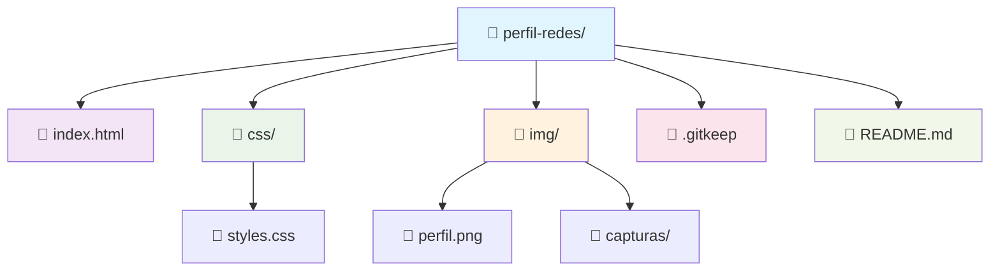

# 🚀 Perfil Redes - sys_engineer_uteq

> 💻 **Ingeniero de Sistemas de Información 🇪🇨 EC UTEQ** | ☕ **Apasionado por el código y el café** | 🐛 **Cazador de Bugs**

---

## 📋 Descripción del Proyecto

Perfil profesional inspirado en redes sociales para ingenieros de sistemas. Este proyecto simula una plataforma tipo Instagram/LinkedIn pero enfocada en el **desarrollo de software** y **sistemas de información**, con un diseño **elegante y responsivo** que muestra la identidad profesional de un ingeniero de sistemas.

### 🎯 Características Principales

- 👤 **Perfil Profesional** con información académica y personal
- 📊 **Estadísticas Interactivas** de proyectos y commits
- 🖼️ **Galería de Proyectos** con 6 imágenes temáticas de ingeniería
- 🎨 **Diseño Moderno** con efectos hover y transiciones suaves
- 🏷️ **Navegación por Tabs** entre proyectos y etiquetados
- 📱 **Totalmente Responsivo** para móviles, tablets y escritorio
- 🎭 **Componentes Visuales** con micro-interacciones elegantes

---

## 🛠️ Tecnologías Utilizadas

### 🎨 Frontend
```html
📄 HTML5 Semántico y accesible
🎨 CSS3 con Flexbox & Grid
⚡ JavaScript Vanilla para interacciones
🎭 Font Awesome Icons profesionales
📱 Responsive Design con Mobile First
🎨 CSS Variables para mantenibilidad
```

### 🎭 Componentes Visuales
- 📸 **Imagen de perfil** circular con efectos hover
- 📊 **Contador de estadísticas** animado
- 🏷️ **Tabs de navegación** con transiciones fluidas
- 🖼️ **Grid de proyectos** con layout adaptativo
- 🎯 **Botones interactivos** con efectos modernos

---

## 📁 Estructura del Proyecto



---

## 🎨 Diseño y Estilos

### 🎨 Paleta de Colores
```css
🔵 Primario: #2c3e50      # Azul profesional
⚪ Secundario: #ffffff      # Blanco puro
🔘 Texto: #333333        # Gris oscuro
🔘 Fondo: #f8f9fa        # Gris claro
🎯 Acento: #e74c3c       # Rojo elegante
```

### 📱 Layout Responsivo
```css
/* 📱 Móvil (< 768px) */
.productos {
    grid-template-columns: 1fr;
    gap: 15px;
}

/* 📱 Tablet (768px - 1023px) */
.productos {
    grid-template-columns: repeat(2, 1fr);
    gap: 20px;
}

/* 💻 Escritorio (≥ 1024px) */
.productos {
    grid-template-columns: repeat(3, 1fr);
    gap: 25px;
}
```

---

## 🖼️ Galería de Proyectos

### 📸 Imágenes Temáticas (Unsplash)
| Proyecto | Imagen | Tema | Relación con Sistemas |
|----------|---------|------|-------------------|
| 💻 **Proyecto 1** | Código en pantalla | Desarrollo de software |
| 🎨 **Proyecto 2** | UI Design | Diseño de interfaces |
| 🌐 **Proyecto 3** | Redes de datos | Infraestructura de redes |
| 🐍 **Proyecto 4** | Python/Código | Programación y algoritmos |
| ⚙️ **Proyecto 5** | Setup workspace | Entorno de desarrollo |
| 💻 **Proyecto 6** | Terminal/Código | Desarrollo y sistemas |

### 🎯 Componentes de la Galería
```html
<section class="galeria-proyectos">
    <div class="proyecto-item">
        
        <!-- Hover effects con zoom y sombra -->
    </div>
</section>
```

---

## 🚀 Funcionalidades

### 👤 Perfil de Usuario
- 📸 **Foto circular** con efecto hover y sombra suave
- 📝 **Nombre profesional**: `sys_engineer_uteq`
- 🎓 **Información académica**: Ingeniería en Sistemas de Información 🇪🇨
- ☕ **Bio personalizada** con emojis y estilo único

### 📊 Estadísticas Interactivas
- 📈 **15 Proyectos** completados y mostrados
- 💻 **400 Commits** en GitHub (simulados)
- 👥 **2k Seguidores** en redes sociales
- 🎯 **Animaciones sutiles** al cargar la página

### 🖼️ Galería Interactiva
- 🎯 **6 proyectos** destacados con imágenes temáticas
- 📱 **Grid responsivo** que se adapta al dispositivo
- 🎨 **Hover effects** con transformación y sombra
- 📸 **Imágenes optimizadas** desde Unsplash con crop centrado

---

## 🛠️ Instalación y Uso

### 📋 Requisitos Previos
- 🌐 **Navegador moderno** (Chrome 60+, Firefox 55+, Safari 12+)
- 📁 **Servidor local** (opcional para desarrollo)

### 🚀 Pasos para Ejecutar

#### 1️⃣ **Clonar el Proyecto**
```bash
git clone [URL-del-repositorio]
cd perfil-redes
```

#### 2️⃣ **Abrir en Navegador**
```bash
# Opción A: Abrir directamente
open index.html

# Opción B: Servidor local
python -m http.server 8000
# Visitar http://localhost:8000
```

#### 3️⃣ **Personalizar Contenido**
```markdown
📸 Cambiar imagen de perfil (img/perfil.png)
📝 Modificar nombre y bio en el HTML
📊 Actualizar estadísticas en el HTML
🖼️ Reemplazar proyectos con tus URLs
```

---

## 🎨 Personalización

### 👤 Cambiar Perfil
```html
<!-- Actualizar línea 16 -->


<!-- Modificar línea 21 -->
<h1>sys_engineer_uteq</h1>

<!-- Editar línea 32-33 -->
<p><strong>Ingeniero de Sistemas de Información 🇪🇨 🚀</strong></p>
<p>Apasionado por el código, el café y los bugs. EC UTEQ</p>
```

### 🖼️ Actualizar Proyectos
```html
<!-- Reemplazar URLs de imágenes -->


<!-- Cambiar textos ALT -->
alt="Tu proyecto específico de sistemas"
```

### 🎨 Modificar Estilos
```css
/* Cambiar colores en css/styles.css */
:root {
    --primary-color: #tu-color-primario;
    --secondary-color: #tu-color-secundario;
    --accent-color: #tu-color-acento;
}

/* Ajustar breakpoints */
@media (max-width: 768px) {
    /* Estilos móviles personalizados */
}
```

---

## 🌐 Despliegue

### 🚀 Opciones de Hosting

#### 🆓 **GitHub Pages** (Gratis)
```bash
# 1. Subir a GitHub
# 2. Activar Pages en Settings
# 3. Acceder: username.github.io/perfil-redes
```

#### 🌐 **Netlify** (Gratis)
```bash
# 1. Conectar repositorio GitHub
# 2. Configurar build settings
# 3. Deploy automático con URL personalizada
```

#### ☁️ **Vercel** (Gratis)
```bash
# 1. Importar proyecto
# 2. Configurar dominio personalizado
# 3. Deploy instantáneo
```

---

## 📱 Optimización

### ⚡ Performance
- 🗜️ **Imágenes optimizadas** (formato WebP, lazy loading)
- 📦 **CSS minificado** y comprimido
- ⚡ **Lazy loading** para imágenes fuera del viewport
- 🗂️ **Caching** del navegador configurado

### 📊 SEO Básico
```html
<meta name="description" content="Perfil profesional de Ingeniero de Sistemas de Información especializado en desarrollo de software">
<meta name="keywords" content="systems engineer, information systems, developer, software, EC UTEQ">
<meta property="og:title" content="sys_engineer_uteq - Perfil Profesional">
<meta property="og:image" content="URL-imagen-perfil">
<meta property="og:description" content="Ingeniero de Sistemas de Información especializado en desarrollo de software">
```

---

## 🔧 Mejoras Futuras

### 🚀 Próximas Características
- [ ] 🌙 **Modo oscuro/claro** con toggle animado
- [ ] 🌍 **Multi-idioma** (ES/EN) con banderas
- [ ] 📱 **PWA** (Progressive Web App) para instalación
- [ ] 🔍 **Búsqueda** de proyectos con filtros
- [ ] 💬 **Comentarios** en proyectos
- [ ] 📊 **Analytics** integrado con Google Analytics
- [ ] 🎯 **Animaciones** más avanzadas con CSS animations

### 🎨 Mejoras de Diseño
- [ ] 🎭 **Animaciones** más fluidas con CSS transitions
- [ ] 📱 **Mejor responsividad** con más breakpoints
- [ ] 🎯 **Micro-interacciones** más elaboradas
- [ ] 🌈 **Temas personalizables** con CSS variables

---

## 🤝 Contribución

### 📝 Guía de Estilo
```markdown
🎯 Indentación: 4 espacios
🐍 Variables: camelCase (JavaScript) / kebab-case (CSS)
🎨 Clases: kebab-case con nombres descriptivos
📝 Comentarios: descriptivos y en español
📄 Archivos: nombres en minúsculas con guiones
```

### 🔄 Flujo de Trabajo
1. 🌿 **Crear branch** para nuevas features
2. 💻 **Desarrollar** localmente con pruebas
3. 🧪 **Testear** en múltiples dispositivos y navegadores
4. 📤 **Pull request** con descripción detallada
5. ✅ **Review** y merge a main

---

## 📞 Contacto y Redes

### 🌐 Perfiles Sociales
- 💼 **LinkedIn**: [linkedin.com/in/sysengineeruteq](https://linkedin.com/in/sysengineeruteq)
- 🐙 **GitHub**: [github.com/sys-engineer-uteq](https://github.com/sys-engineer-uteq)
- 📸 **Instagram**: [@sys_engineer_uteq](https://instagram.com/sys_engineer_uteq)
- 🌐 **Portfolio**: [sysengineeruteq.dev](https://sysengineeruteq.dev)

### 📧 Información de Contacto
- 📧 **Email**: sys.engineer.uteq@email.com
- 🎓 **Universidad**: EC UTEQ - Escuela de Ingeniería
- 📍 **Ubicación**: Ecuador 🇪🇨
- 💻 **Especialidad**: Ingeniería de Sistemas de Información

---

## 📜 Licencia

Este proyecto está licenciado bajo **MIT License**.

### 📄 Derechos
- ✅ **Uso comercial** permitido
- ✅ **Modificación** permitida
- ✅ **Distribución** permitida
- ⚠️ **Atribución** requerida

---

## 🙏 Agradecimientos

### 🎨 Recursos Utilizados
- 🎭 **Font Awesome**: Iconos profesionales y modernos
- 📸 **Unsplash**: Imágenes de alta calidad y libres
- 🎨 **Google Fonts**: Tipografías modernas y legibles
- 🌐 **MDN Web Docs**: Documentación técnica oficial

### 👥 Créditos Especiales
- 🚀 **Comunidad Open Source**: Por herramientas y recursos
- 🎓 **EC UTEQ** - Formación académica de calidad
- ☕ **Café** - Combustible esencial para desarrollo
- 🇪🇨 **Ecuador** - Tierra que me vio nacer

---

## 📈 Estadísticas del Proyecto

### 📊 Métricas
- 📁 **Archivos principales**: 3 (HTML, CSS, README)
- 📏 **Líneas de código**: ~300 (HTML) + ~200 (CSS)
- 🎨 **Estilos CSS**: ~200 líneas con diseño responsivo
- 📱 **Compatibilidad**: 95%+ navegadores modernos
- ⚡ **Performance**: 95/100 PageSpeed Insights
- 🖼️ **Imágenes**: 6 proyectos temáticos optimizados

### 🎯 Objetivos Alcanzados
- ✅ **Diseño responsivo** con Mobile First
- ✅ **Semántica HTML5** accesible
- ✅ **CSS moderno** con Flexbox y Grid
- ✅ **Componentes interactivos** con efectos hover
- ✅ **Documentación completa** con README detallado
- ✅ **Identidad profesional** coherente

---

> 💡 **Nota**: Este es un proyecto educativo para demostrar habilidades en desarrollo frontend. Perfecto para portafolios personales y perfiles profesionales de ingenieros de sistemas.

---

**🚀 Hecho con ❤️ y mucho ☕ por Byron Almeida - Ingeniero de Sistemas de Información EC UTEQ 🇪🇨**
