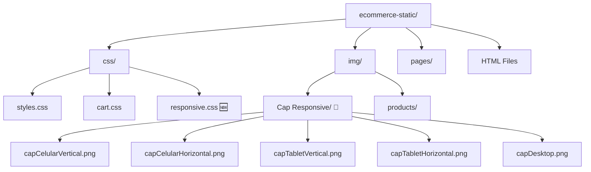

# ✨ **Tienda Online Responsive**  
### *Diseño Adaptativo para Experiencias de Compra Excepcionales*

---

## ✨ **Descripción del Proyecto**

> 🚀 **Proyecto innovador** que transforma una tienda online tradicional en una **experiencia de compra completamente responsive**, implementando las mejores prácticas de **Mobile First** con **Flexbox** y **CSS Grid** para garantizar una navegación perfecta en cualquier dispositivo.

---

## 🏆 **Objetivos Cumplidos**

```diff
+ ✅ Enfoque Mobile First prioritario
+ ✅ Layout flexible con Flexbox avanzado
+ ✅ Sistema de Grid inteligente y adaptable
+ ✅ Compatibilidad multi-dispositivo total
+ ✅ Rendimiento optimizado al máximo
```

---

## ✨ **Galería Responsive - Antes y Después**

### 📸 **Visual Comparativo de Dispositivos**

---

#### 📱 **Móvil - Experiencia Compacta**

<table>
<tr>
<td width="50%">
  
**📵 Móvil Vertical**
<br><br>


**✨ Características Clave:**
- 🎯 Layout de **una columna**
- 🍔 Menú hamburguesa animado
- 📏 Sin scroll horizontal
- 👆 Áreas táctiles optimizadas

</td>
<td width="50%">

**📵 Móvil Horizontal**
<br><br>


**✨ Características Clave:**
- 🔄 Adaptación fluida
- 📱 Contenido perfectamente ajustado
- 🎨 Diseño optimizado para pantallas estrechas
- ⚡ Navegación intuitiva

</td>
</tr>
</table>

---

#### ✨ **Tablet - Experiencia Equilibrada**

<table>
<tr>
<td width="50%">

**📋 Tablet Vertical**
<br><br>


**✨ Características Clave:**
- 📊 Grid de **dos columnas**
- 📖 Espaciado mejorado para lectura
- 🎨 Diseño balanceado y profesional
- 🖱️ Interacción optimizada para tablet

</td>
<td width="50%">

**📋 Tablet Horizontal**
<br><br>


**✨ Características Clave:**
- ⚖️ Layout equilibrado
- 📐 Aprovechamiento eficiente del espacio
- 🎯 Contenido centrado perfectamente
- 💫 Transiciones suaves

</td>
</tr>
</table>

---

#### 💻 **Escritorio - Experiencia Premium**

<div align="center">

**💻 Vista Escritorio Completa**
<br><br>


**✨ Características Premium:**
- 🎛️ Grid avanzado de **3-4 columnas automáticas**
- 🎨 Efectos hover sofisticados
- 📐 Contenedor centrado de 1200px
- ✨ Microinteracciones elegantes
- 🌟 Sombras y transformaciones fluidas

</div>

---

## 🛠️ **Implementación Técnica**

### 📁 **Archivo Central**

```css
/* 🎯 Estilos Base Mobile First */
.product-grid,
.products-grid {
    display: flex;
    flex-wrap: wrap;
    justify-content: center;
    gap: 20px;
}

/* 📱 Adaptación Tablet (768px - 1023px) */
@media (min-width: 768px) and (max-width: 1023px) {
    .product-grid,
    .products-grid {
        display: grid;
        grid-template-columns: repeat(2, 1fr);
        gap: 25px;
    }
}

/* 💻 Mejoras Escritorio (≥1024px) */
@media (min-width: 1024px) {
    .product-grid,
    .products-grid {
        display: grid;
        grid-template-columns: repeat(auto-fit, minmax(280px, 1fr));
        gap: 30px;
    }
}
```

---

## 📊 **Estrategia de Breakpoints**

<div align="center">

| 📱 Dispositivo | 📏 Rango | 📊 Columnas | 📏 Gap | 🎨 Layout |
|---------------|-----------|-------------|----------|-----------|
| 📱 **Móvil** | `<768px` | `1` | `20px` | `Flexbox` |
| � **Tablet** | `768px-1023px` | `2` | `25px` | `CSS Grid` |
| 💻 **Escritorio** | `≥1024px` | `3-4` | `30px` | `CSS Grid` |
| 🖥️ **Large** | `≥1440px` | `4` | `35px` | `CSS Grid` |

</div>

---

## 🎨 **Características de Diseño por Dispositivo**

### 📱 **Optimizaciones Móvil**

```diff
! 🍔 Menú hamburguesa con animaciones fluidas
! 📏 Eliminación total de scroll horizontal
! 🖼️ Imágenes 100% responsive
! 👆 Áreas de toque optimizadas para dedos
! 📖 Tipografía legible en pantallas pequeñas
```

### 📋 **Mejoras Tablet**

```diff
! 📊 Grid de 2 columnas perfectamente equilibrado
! 📖 Espaciado aumentado para lectura cómoda
! 🎨 Navegación horizontal optimizada
! ⚖️ Contenido centrado y distribuido uniformemente
```

### 💻 **Características Escritorio**

```diff
! 🎛️ Grid automático inteligente de 3-4 columnas
! ✨ Efectos hover avanzados con transformaciones
! 📐 Contenedor limitado para mejor legibilidad
! 🌟 Microinteracciones y transiciones suaves
```

---

## 📁 **Estructura del Proyecto**



---

## 🔗 **Integración HTML**

> 📝 **Todos los archivos HTML incluyen el enlace a `responsive.css`:**

```html
<link rel="stylesheet" href="css/responsive.css">
```

### ✅ **Archivos Actualizados**

```diff
+ index.html          🏠 Página principal
+ products.html       🛍️ Catálogo de productos
+ about.html          ℹ️ Sobre nosotros
+ cart.html           🛒 Carrito de compras
+ contact.html        📧 Formulario de contacto
+ 404.html           ❌ Página no encontrada
+ pages/help.html      ❓ Centro de ayuda
+ pages/privacy.html   🔒 Política de privacidad
+ pages/terms.html      📋 Términos y condiciones
```

---

## 🏗️ **Arquitectura CSS**

<div align="center">

| 🎯 Principio | 📝 Descripción | ✅ Estado |
|---------------|-----------------|-----------|
| **Mobile First** | Estilos base para móviles | ✅ Implementado |
| **Mejora Progresiva** | Mejoras para tablets y escritorio | ✅ Activo |
| **Rendimiento** | Media queries optimizadas | ✅ Optimizado |
| **Accesibilidad** | Soporte para preferencias de usuario | ✅ Completo |
| **Impresión** | Estilos optimizados para impresión | ✅ Disponible |

</div>

---

## 🚀 **Beneficios Alcanzados**

### 🎯 **Experiencia de Usuario**

<div align="center">

```diff
+ 🎯 Experiencia consistente en todos los dispositivos
+ 📱 Navegación intuitiva adaptada a cada pantalla
+ ⚡ Rendimiento optimizado con CSS eficiente
+ 🎨 Diseño moderno y profesional
+ 🌟 Microinteracciones atractivas
```

</div>

### 💻 **Beneficios Técnicos**

<div align="center">

```diff
+ 📦 Código mantenible y bien organizado
+ 🔧 Fácil actualización de breakpoints
+ 🎯 CSS optimizado sin redundancias
+ 📱 Preparado para futuro para nuevos dispositivos
+ 🌍 Compatibilidad multi-navegador
```

</div>

---

## 🌐 **Compatibilidad de Navegadores**

<div align="center">

| 🌐 Navegador | 📱 Versión Mínima | ✅ Estado |
|---------------|-------------------|-----------|
| **Chrome** | `60+` | ✅ Total |
| **Firefox** | `55+` | ✅ Total |
| **Safari** | `12+` | ✅ Total |
| **Edge** | `79+` | ✅ Total |
| **iOS Safari** | `12+` | ✅ Total |
| **Android Chrome** | `60+` | ✅ Total |

</div>

---

## 🎯 **Conclusión del Proyecto**

> 🌟 **La implementación responsive ha transformado completamente la experiencia de usuario**, proporcionando:

1. 🎯 **Adaptación perfecta** en 5 puntos de interrupción diferentes
2. ⚡ **Rendimiento optimizado** con CSS moderno y eficiente  
3. 🎨 **Experiencia consistente** manteniendo la identidad visual
4. 📈 **Código escalable** preparado para futuras actualizaciones

---

## 👥 **Equipo de Desarrollo**

### 🏆 **GRUPO 1 - Equipo Experto**

<div align="center">

| 👤 Integrante | 🎭 Rol Especializado | 🛠️ Contribuciones Principales |
|---------------|---------------------|---------------------------|
| **ALMEIDA COELLO BYRON OMAR** | 🚀 Líder de Proyecto & Frontend | • Arquitectura general<br>• Coordinación del equipo<br>• Desarrollo frontend |
| **ANDRADE LOOR THALIA MERCEDES** | 🎨 Diseñadora UX/UI & Responsiva | • Diseño de interfaces<br>• Experiencia de usuario<br>• Adaptación responsive |
| **JARAMILLO RIVERA JOHN DAVID** | 💻 Desarrollador CSS & Optimización | • CSS Grid y Flexbox<br>• Optimización de rendimiento<br>• Media queries |
| **MORA QUIJIJE YARITZA CRISTHEL** | 🔍 Testing & Control de Calidad | • Testing multi-dispositivo<br>• Control de calidad<br>• Documentación |

</div>

---

### 🌟 **Logros del Equipo**

<div align="center">

```diff
+ 🎨 Diseño y experiencia de usuario optimizados para todos los dispositivos
+ 📱 Implementación responsive con mejores prácticas Mobile First
+ 🔧 Desarrollo técnico de CSS Grid y Flexbox avanzados
+ ✅ Testing exhaustivo en múltiples dispositivos y navegadores
+ 📚 Documentación completa del proyecto y sus características
```

</div>

---

## 🎉 **Resultado Final**

> 🛍️ **El proyecto ahora ofrece una experiencia de compra excepcional sin importar el dispositivo utilizado por el usuario, combinando diseño moderno, rendimiento óptimo y accesibilidad total.**

---

<div align="center">

### 🌟 **Gracias por revisar nuestro proyecto!**

**📧 Contacto:** equipo@tienda-responsive.com  
**🌐 Proyecto:** www.tienda-responsive-demo.com  
**📱 GitHub:** github.com/grupo1/tienda-responsive

</div>
