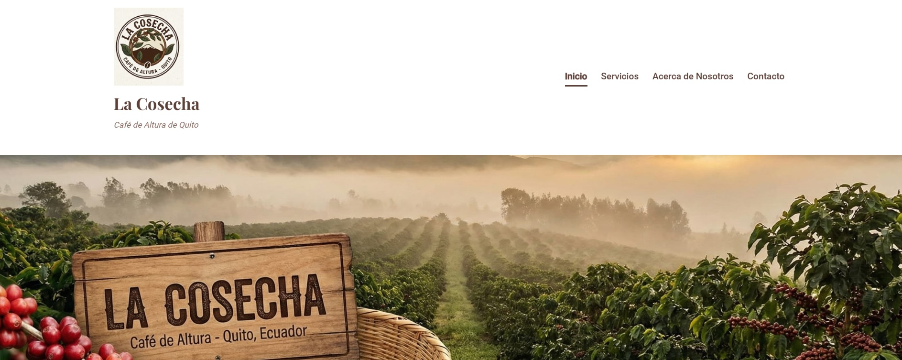
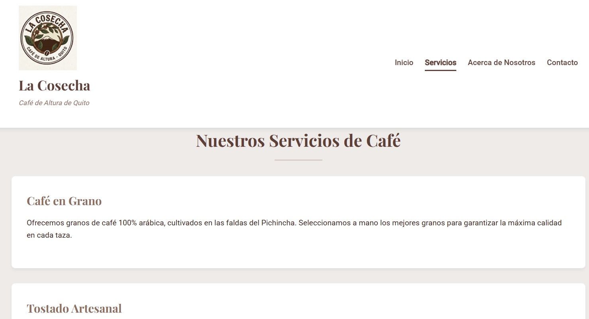

# La Cosecha - Sitio Web


Sitio web oficial de La Cosecha, cafetería de especialidad ubicada en Quito, Ecuador. Este proyecto muestra nuestros productos, servicios y la pasión por el café de altura andino.

## 🚀 Características

- Página de inicio con información destacada
- Sección de servicios de café
- Acerca de nuestra historia y equipo
- Formulario de contacto funcional
- Diseño responsivo para todos los dispositivos
- Navegación intuitiva

## 🛠️ Tecnologías Utilizadas

- HTML5
- CSS3
- Responsive Design
- Buenas prácticas de SEO

## 📸 Capturas de Pantalla (Evidencia)

### Vista de la Página de Inicio
Aquí se muestra el Header, la sección Hero y la presentación de la marca.


### Vista de Servicios
Detalle de los servicios ofrecidos por la cafetería.


## 📁 Estructura del Proyecto

```
la-cosecha/
├── css/
│   └── style.css          # Estilos principales
├── img/                   # Imágenes del sitio
│   └── logo.jpg
├── pages/
│   ├── servicios.html     # Página de servicios
│   ├── acerca.html        # Sobre nosotros
│   └── contacto.html      # Formulario de contacto
├── index.html             # Página de inicio
└── README.md              # Este archivo
```

## 🌐 Navegación

- **Inicio**: Página principal con información destacada
- **Servicios**: Nuestra oferta de productos y servicios de café
- **Acerca de**: Historia y equipo de La Cosecha
- **Contacto**: Formulario para ponerse en contacto con nosotros

## 🎨 Paleta de Colores

- Principal: `#5D4037` (Marrón oscuro)
- Secundario: `#8D6E63` (Marrón claro)
- Fondo: `#EFEBE9` (Beige claro)
- Texto: `#3E2723` (Casi negro)

## 📱 Diseño Responsive

El sitio está diseñado para funcionar perfectamente en:
- Escritorio (≥1200px)
- Tablets (≥768px)
- Móviles (≥320px)

## 📝 Requisitos

- Navegador web actualizado (Chrome, Firefox, Safari, Edge)
- Conexión a internet (para fuentes de Google)

## 🚀 Cómo Empezar

1. Clona el repositorio:
   ```bash
   git clone https://github.com/tu-usuario/la-cosecha.git
   ```
2. Abre el archivo `index.html` en tu navegador

## 📄 Licencia

Este proyecto está bajo la Licencia MIT. Ver el archivo `LICENSE` para más detalles.

## 🤝 Contribuciones

Las contribuciones son bienvenidas. Por favor, lee las [pautas de contribución](CONTRIBUTING.md) antes de enviar un pull request.

## 📧 Contacto

Para más información, contáctanos en:
- Email: info@lacosecha.com
- Teléfono: +593 2 123 4567
- Dirección: Av. Amazonas N23-45 y Veintimilla, Quito, Ecuador

---

Desarrollado con ❤️ por Grupo 1 para La Cosecha - Dic 2025
