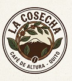
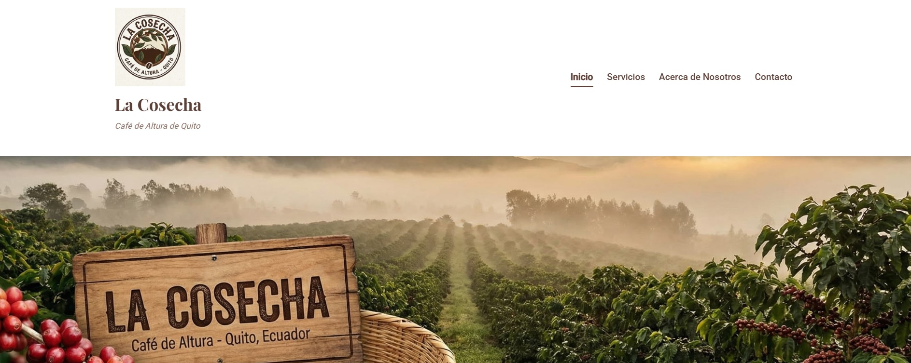
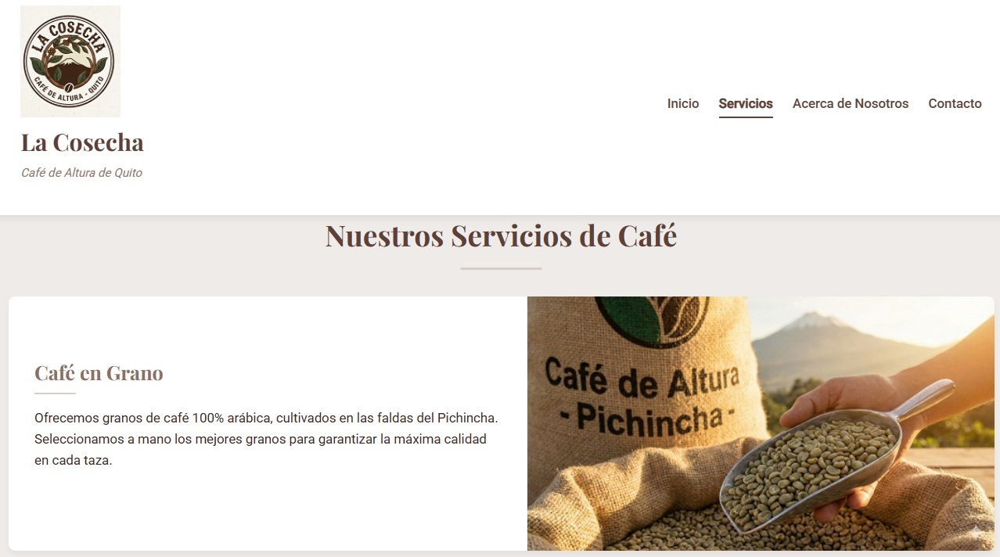
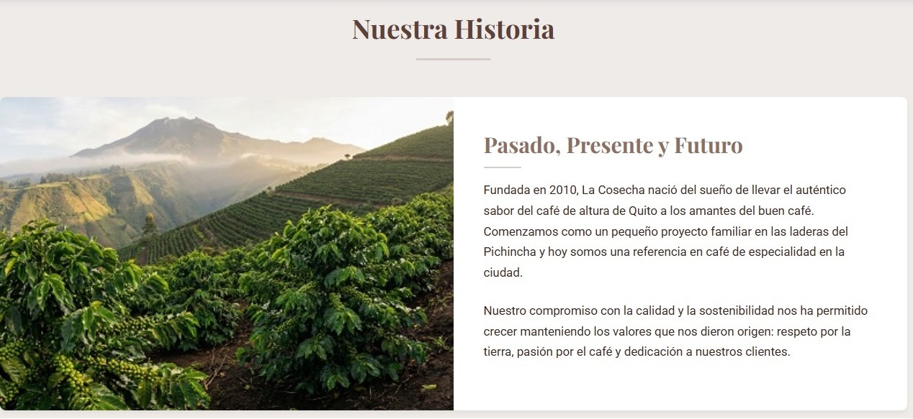

# La Cosecha - Sitio Web



Sitio web oficial de La Cosecha, cafetería de especialidad ubicada en Quito, Ecuador. Este proyecto muestra nuestros productos, servicios y la pasión por el café de altura andino.

## 🚀 Características

- Página de inicio con información destacada
- Sección de servicios de café
- Acerca de nuestra historia y equipo
- Formulario de contacto funcional
- Diseño responsivo para todos los dispositivos
- Navegación intuitiva

## 🛠️ Tecnologías Utilizadas

- HTML5
- CSS3
- Responsive Design
- Buenas prácticas de SEO

## 📁 Estructura del Proyecto

```
la-cosecha/
├── css/
│   └── style.css             # Estilos principales
├── img/                      # Imágenes del sitio
│   ├── acerca/               # Imágenes de la sección "Acerca de"
│   │   ├── cafe-cultivo.jpg
│   │   ├── nuestro-equipo.jpg
│   │   └── nuestro-compromiso.jpg
│   ├── products/             # Imágenes de productos
│   │   ├── cafe-grano.jpg
│   │   ├── tostado-artesanal.jpg
│   │   └── catas-talleres.jpg
│   ├── screenshots/          # Capturas de pantalla para el README
│   │   ├── home.jpg
│   │   ├── servicios.jpg
│   │   └── acerca.jpg
│   ├── banner.jpg            # Banner principal
│   └── logo.jpg              # Logo de la marca
├── pages/
│   ├── servicios.html        # Página de servicios
│   ├── acerca.html           # Sobre nosotros
│   └── contacto.html         # Formulario de contacto
├── index.html               # Página de inicio
└── README.md                # Este archivo

## 🚀 Cómo Empezar

### Requisitos Previos
- Navegador web actualizado (Chrome, Firefox, Safari, Edge)
- Git instalado (opcional)

### Instalación Local

1. Clona el repositorio:
   ```bash
   git clone https://github.com/balmeidac/diseno-sitios-web.git
   ```

2. Navega al directorio del proyecto:
   ```bash
   cd diseno-sitios-web/semana-04/la-cosecha
   ```

3. Abre el archivo `index.html` en tu navegador:
   - Haz doble clic en el archivo, o
   - Arrástralo a una ventana del navegador, o
   - Usa la opción "Abrir con" del menú contextual

## 📸 Capturas de Pantalla

Las siguientes capturas de pantalla muestran las diferentes secciones del sitio web. Para ver las imágenes en su totalidad, asegúrate de que los archivos estén en la carpeta `img/screenshots/` con los nombres indicados.

### Página de Inicio

*Presentación de la marca y productos destacados*

### Nuestros Servicios

*Muestra de nuestros productos y servicios de café*

### Acerca de Nosotros

*Nuestra historia y equipo de trabajo*

## 📄 Licencia

Este proyecto está bajo la [Licencia MIT](LICENSE).

## 🤝 Cómo Contribuir

Las contribuciones son bienvenidas. Sigue estos pasos:

1. Haz un Fork del proyecto
2. Crea una rama con tu nueva característica (`git checkout -b feature/nueva-caracteristica`)
3. Haz commit de tus cambios (`git commit -m 'Añade nueva característica'`)
4. Haz push a la rama (`git push origin feature/nueva-caracteristica`)
5. Abre un Pull Request

## 👥 Autores

Este proyecto fue desarrollado por el **Grupo 1 - SISINF-A** para la asignatura de Diseño de Sitios Web:

* **JARAMILLO RIVERA JOHN DAVID** - *Desarrollador / Diseño*
* **MORA QUIJIJE YARITZA CRISTHEL** - *Investigación / Contenido*
* **ANDRADE LOOR THALIA MERCEDES** - *QA / Documentación*
* **ALMEIDA COELLO BYRON OMAR (balmeidac)** - *Líder de Proyecto / Integración*

## 📧 Contacto

¿Tienes preguntas o comentarios? No dudes en contactarnos:

- ✉️ Email: info@lacosecha.com
- 📞 Teléfono: +593 2 123 4567
- 📍 Dirección: Av. Amazonas N23-45 y Veintimilla, Quito, Ecuador
- 🌐 Sitio web: [www.lacosecha.com](https://www.lacosecha.com)

---

*© 2025 La Cosecha - Todos los derechos reservados*

Desarrollado con ❤️ por Grupo 1 para La Cosecha - Dic 2025
