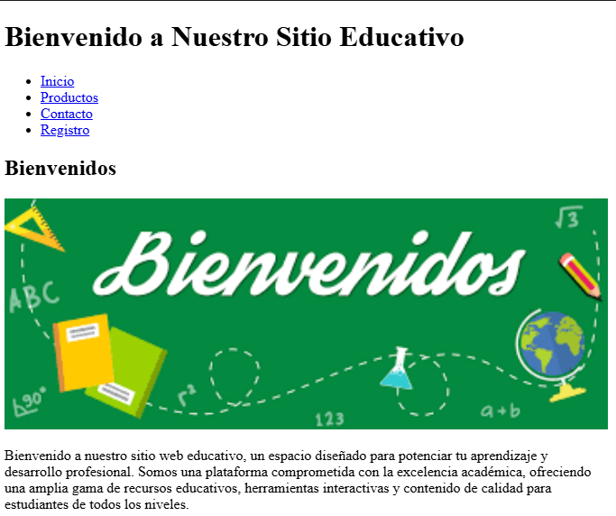
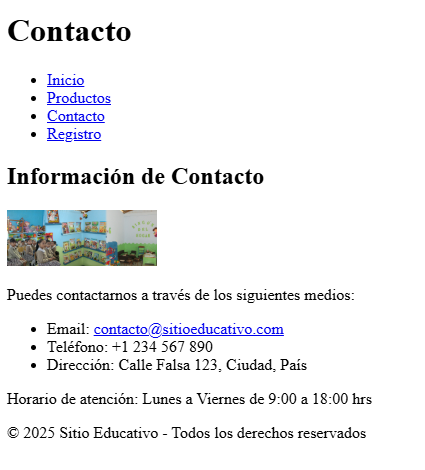
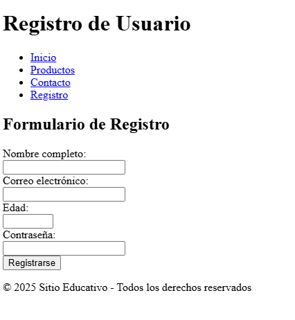

# Sitio Web Educativo

Bienvenido al repositorio del sitio web educativo, una plataforma diseñada para facilitar el aprendizaje en línea con recursos educativos de calidad.

## Descripción del Proyecto

Este proyecto consiste en el desarrollo de un sitio web educativo que ofrece recursos, herramientas y materiales de aprendizaje para estudiantes de diferentes niveles. El sitio está construido con tecnologías web estándar como HTML, CSS y JavaScript.

## Estructura del Proyecto

```
.
├── index.html          # Página principal
├── productos.html      # Página de productos/servicios
├── contacto.html       # Formulario de contacto
├── registro.html       # Página de registro de usuarios
├── img/               # Directorio para imágenes
│   └── banner.jpg     # Imagen del banner principal
└── README.md          # Este archivo
```

## Equipo de Desarrollo

### Equipo del Proyecto

- **Almeida Coello Byron Omar** - Desarrollador Frontend
- **Andrade Loor Thalia Mercedes** - Diseñadora UI/UX
- **Jaramillo Rivera John David** - Desarrollador Backend
- **Mora Quijije Yaritza Cristhel** - Gestora de Contenidos

## Capturas

Aquí puedes ver las capturas de pantalla del sitio web:

<div align="center">

| Página | Captura |
|--------|---------|
| ### Página de Inicio

*Presentación de la marca y productos destacados*
| **Página de Productos** |  |
| **Formulario de Contacto** |  |
| **Página de Registro** |  |

</div>

## Cómo Contribuir

1. Haz un fork del repositorio
2. Crea una rama para tu característica (`git checkout -b feature/nueva-caracteristica`)
3. Haz commit de tus cambios (`git commit -am 'Añadir nueva característica'`)
4. Haz push a la rama (`git push origin feature/nueva-caracteristica`)
5. Abre un Pull Request

## Licencia

Este proyecto está bajo la Licencia MIT. Ver el archivo `LICENSE` para más información.

---
*Última actualización: Diciembre 2025*

