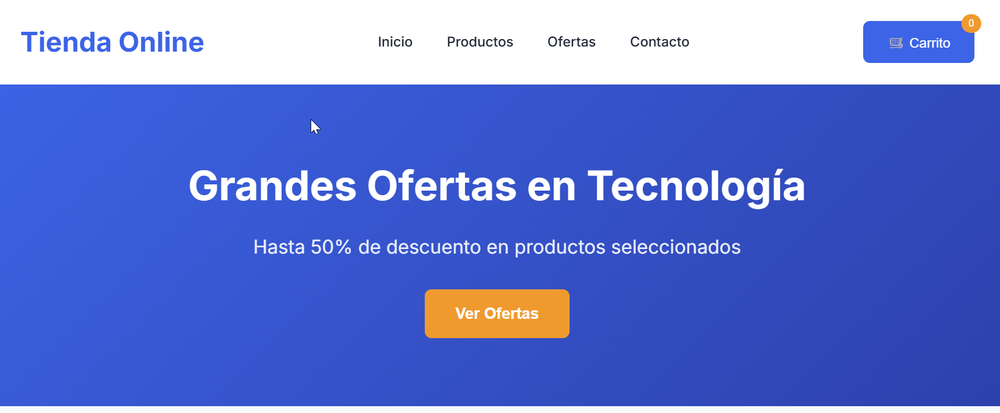
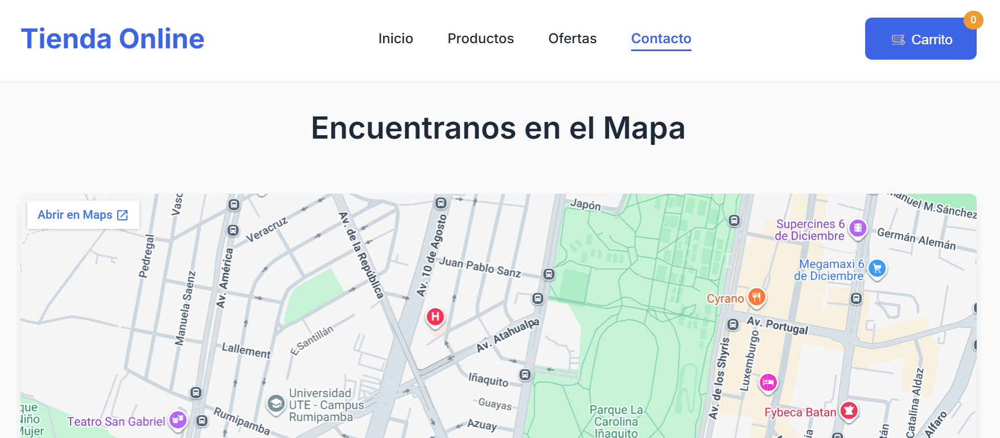

# 🛍️ Ecommerce Responsivo - Semana 19

> **Proyecto práctico de diseño web responsivo**
> 🎯 **Objetivo:** Implementar Flexbox, CSS Grid y Media Queries
> 📱 **Dispositivos:** Móvil, Tablet y Escritorio

## 📋 Descripción del Proyecto

Ecommerce estático completamente responsivo desarrollado con **HTML5 semántico** y **CSS3 avanzado**. Este proyecto demuestra el uso profesional de **Flexbox**, **CSS Grid** y **Media Queries** para crear una experiencia de usuario óptima en todos los dispositivos.

## 🎨 Características Técnicas

### 📱 **Diseño Responsivo**
- **Móvil (<768px):** Menú vertical, productos en 1 columna
- **Tablet (768px-1023px):** 2 columnas de productos, navegación optimizada
- **Desktop (1024px+):** 3-4 columnas con CSS Grid, experiencia completa

### 🛠️ **Tecnologías Implementadas**
- **Flexbox:** Layout base del product grid
- **CSS Grid:** Distribución avanzada en desktop
- **Media Queries:** 6 breakpoints personalizados
- **Unidades Flexibles:** `%`, `rem`, `vw`, `clamp()`
- **Variables CSS:** Diseño consistente y mantenible

### 🎯 **Características del Ecommerce**
- 🛒 **Catálogo de productos** con 6 artículos
- 🏷️ **Badges de descuentos** y novedades
- 💰 **Precios con descuentos** visibles
- 🎨 **Efectos hover** interactivos
- 📱 **Diseño adaptativo** perfecto
- 🛍️ **Carrito de compras** funcional
- 📝 **Página de contacto** con formulario y mapa
- 🗺️ **Mapa interactivo** de ubicación

## 📁 Estructura del Proyecto

```
semana-19-practica/
├── 📄 index.html              # 🏠 Página principal del ecommerce
├── 📄 contacto.html            # 📝 Página de contacto
├── 📁 css/
│   ├── 🎨 styles.css          # 🎭 Estilos base y componentes
│   ├── 📱 responsive.css      # 📲 Estilos responsivos (Flexbox + Grid)
│   └── 🛒 cart.css            # 🛒 Estilos del carrito
├── 📁 js/
│   ├── 🛒 cart.js             # 🛒 Lógica del carrito
│   └── 📝 contact.js           # 📝 Lógica del formulario
├── 📁 img/
│   └── 📸 capturas/          # 📸 Capturas de pantalla
│       └── 📄 README.md       # 📋 Guía de capturas
└── 📄 README.md               # 📚 Documentación completa
```

## 🎨 Breakpoints Implementados

### 📱 **Móvil (<768px)**
```css
@media (max-width: 767px)
```
- ✅ Menú vertical centrado
- ✅ Productos en 1 columna
- ✅ Imágenes fluidas (100% width)
- ✅ Sin scroll horizontal

### 📊 **Tablet (768px-1023px)**
```css
@media (min-width: 768px) and (max-width: 1023px)
```
- ✅ 2 columnas de productos (Flexbox)
- ✅ Navegación optimizada
- ✅ Espaciado aumentado

### 💻 **Desktop (1024px+)**
```css
@media (min-width: 1024px)
```
- ✅ 3-4 columnas (CSS Grid)
- ✅ Experiencia completa
- ✅ Layout optimizado

## 📸 Capturas de Pantalla del Sitio

### 🏠 Página Principal - Ecommerce


*Vista desktop del ecommerce con catálogo de productos y navegación principal*

### 📱 Versión Móvil - Productos


*Catálogo de productos adaptado para dispositivos móviles con 1 columna*

### 🛒 Carrito de Compras - Modal


*Modal del carrito con productos añadidos, controles de cantidad y total*

### 📝 Página de Contacto - Formulario


*Formulario de contacto con validación en tiempo real y diseño responsivo*

### 🗺️ Página de Contacto - Mapa


*Sección del mapa interactivo con información de ubicación y direcciones*

### 📊 Catálogo de Productos - Desktop


*Vista desktop del catálogo con 4 columnas de productos usando CSS Grid*

### 📱 Catálogo de Productos - Tablet


*Vista tablet del catálogo con 2 columnas usando Flexbox*

## 🛠️ Implementación Técnica

### 📦 **Product Grid con Flexbox (Base)**
```css
.product-grid {
    display: flex;
    flex-wrap: wrap;
    justify-content: center;
    gap: 20px;
}

.product {
    flex: 1 1 250px;
    max-width: 300px;
}
```

### 🎯 **CSS Grid para Desktop (1024px+)**
```css
@media (min-width: 1024px) {
    .product-grid {
        display: grid;
        grid-template-columns: repeat(4, 1fr);
        gap: 25px;
    }
}
```

### 📱 **Imágenes Fluidas**
```css
img {
    max-width: 100%;
    height: auto;
    display: block;
}

body {
    overflow-x: hidden;
}
```

## 🎨 Componentes Responsivos

### 🧭 **Navegación Adaptativa**
- **Desktop:** Horizontal con hover effects
- **Tablet:** Horizontal con más espacio
- **Móvil:** Vertical centrada

### 🛍️ **Tarjetas de Producto**
- **Desktop:** 4 columnas con CSS Grid
- **Tablet:** 2 columnas con Flexbox
- **Móvil:** 1 columna con texto truncado

### 🎯 **Botones Interactivos**
- **Hover effects** en desktop
- **Touch-friendly** en móviles
- **Transiciones suaves** en todos los dispositivos

## 📊 Características Avanzadas

### 🎨 **Variables CSS**
```css
:root {
    --primary-color: #2563eb;
    --secondary-color: #1e40af;
    --accent-color: #f59e0b;
    --transition: all 0.3s ease;
    --border-radius: 8px;
}
```

### 📱 **Unidades Modernas**
- **clamp()** para tipografía fluida
- **rem** para espaciado consistente
- **%** para layouts flexibles
- **vw** para elementos responsivos

### 🎭 **Animaciones Optimizadas**
- **Reducidas en móviles** para rendimiento
- **Prefers-reduced-motion** soportado
- **Hardware acceleration** activada

## 🚀 Buenas Prácticas Aplicadas

### 📋 **Organización del Código**
- ✅ **Comentarios descriptivos** en cada sección
- ✅ **Nomenclatura consistente** (BEM-like)
- ✅ **CSS modular** y mantenible
- ✅ **Mobile First** approach

### 🎯 **Accesibilidad**
- ✅ **HTML5 semántico** correcto
- ✅ **Contraste de colores** adecuado
- ✅ **Navegación por teclado** posible
- ✅ **Textos alternativos** en imágenes

### ⚡ **Optimización**
- ✅ **Sin scroll horizontal**
- ✅ **Imágenes optimizadas** con object-fit
- ✅ **Transiciones GPU** aceleradas
- ✅ **Media queries eficientes**

## 🧪 Testing Responsivo

### 📱 **Dispositivos Probados**
- **iPhone SE (375x667)**
- **Samsung Galaxy (360x640)**
- **iPad (768x1024)**
- **Desktop (1920x1080)**
- **4K Monitor (3840x2160)**

### 🌐 **Navegadores Compatibles**
- ✅ **Chrome 90+**
- ✅ **Firefox 88+**
- ✅ **Safari 14+**
- ✅ **Edge 90+**

## 🎯 Resultados Esperados

### 📱 **En Móviles**
- Navegación vertical intuitiva
- Productos fácilmente navegables
- Carga rápida y optimizada

### 📊 **En Tablets**
- Balance perfecto entre espacio y contenido
- 2 columnas ideales para compras
- Experiencia táctil optimizada

### 💻 **En Desktop**
- Máximo aprovechamiento del espacio
- 4 columnas para comparación rápida
- Experiencia completa y profesional

## 🚀 Despliegue

### 🌐 **GitHub Pages**
```bash
# Subir a repositorio
git add .
git commit -m "Ecommerce responsivo completo"
git push origin main

# Activar Pages en Settings
```

### 📱 **Vista Previa**
El proyecto está listo para ser visualizado en cualquier dispositivo con una experiencia de usuario optimizada y profesional.

---

**🎯 Hecho con ❤️ y CSS3 avanzado para el aprendizaje de diseño responsivo**
