# PC Gamer Store - Sitio HTML5 con CSS

Este es un sitio web estático desarrollado únicamente con HTML5, sin el uso de hojas de estilo CSS ni JavaScript. El sitio está diseñado para ser ligero, accesible y compatible con todos los navegadores modernos.

## Estructura del Sitio

El sitio consta de las siguientes páginas principales:

- **index.html** - Página de inicio con productos destacados
- **productos.html** - Catálogo completo de productos
- **contacto.html** - Formulario de contacto e información
- **registro.html** - Formulario de registro de usuarios

## Características

- Totalmente desarrollado en HTML5 semántico
- Sin dependencias externas (CSS, JavaScript, frameworks, etc.)
- Estructura clara y bien organizada
- Navegación intuitiva
- Contenido accesible

## Estructura de Archivos

```mermaid
flowchart TD
    ROOT["📁 PCGamerStore/"]

    ROOT --> IDX["📄 index.html\nPágina de inicio"]
    ROOT --> PROD["📄 productos.html\nCatálogo de productos"]
    ROOT --> CART["📄 carrito.html\nCarrito de compras"]
    ROOT --> CONT["📄 contacto.html\nFormulario de contacto"]
    ROOT --> REG["📄 registro.html\nRegistro de usuarios"]
    ROOT --> ERR["📄 404.html\nPágina de error"]
    ROOT --> README["📄 README.md\nDocumentación"]

    ROOT --> CSS["📁 css/"]
    CSS --> STYLES["📄 styles.css"]

    ROOT --> JS["📁 js/"]
    JS --> CARTJS["📄 cart.js"]

    ROOT --> IMG["📁 img/"]
    IMG --> BANNER["🖼️ banner.jpg"]
    IMG --> LOGO["🖼️ logo.png"]
    IMG --> PERFIL["🖼️ perfil.png"]

    IMG --> DEST["📁 destacados/"]
    DEST --> D1["🖼️ dest1.jpg"]
    DEST --> D2["🖼️ dest2.jpg"]
    DEST --> D3["🖼️ dest3.jpg"]

    IMG --> PRODS["📁 productos/"]
    PRODS --> P1["🖼️ prod1.jpg"]
    PRODS --> P2["🖼️ prod2.jpg"]
    PRODS --> P3["🖼️ prod3.jpg"]
    PRODS --> P4["🖼️ prod4.jpg"]

    IMG --> CAPS["📁 capturas/"]
    CAPS --> C1["🖼️ home.png"]
    CAPS --> C2["🖼️ productos.png"]
    CAPS --> C3["🖼️ carrito.png"]
```

## Capturas de Pantalla

> Las capturas se encuentran en la carpeta `img/capturas/`.

| Página | Vista previa |
|--------|-------------|
| Inicio |  |
| Productos |  |
| Carrito |  |
| Contacto |  |
| Registro |  |

---

## Cómo Usar

1. Clona o descarga el repositorio
2. Abre el archivo [index.html](AQUÍ COLOCA EL REPOSITORIO) en tu navegador web preferido
3. Navega por las diferentes secciones del sitio

## Requisitos

Cualquier navegador web moderno compatible con HTML5, como:
- Google Chrome
- Mozilla Firefox
- Microsoft Edge
- Safari
- Opera

## Notas

- Este sitio es una versión simplificada que solo utiliza HTML5 puro
- No se requiere servidor web para ejecutarlo localmente
- Las imágenes están optimizadas para una carga rápida

## Licencia

Este proyecto está disponible bajo la Licencia MIT.